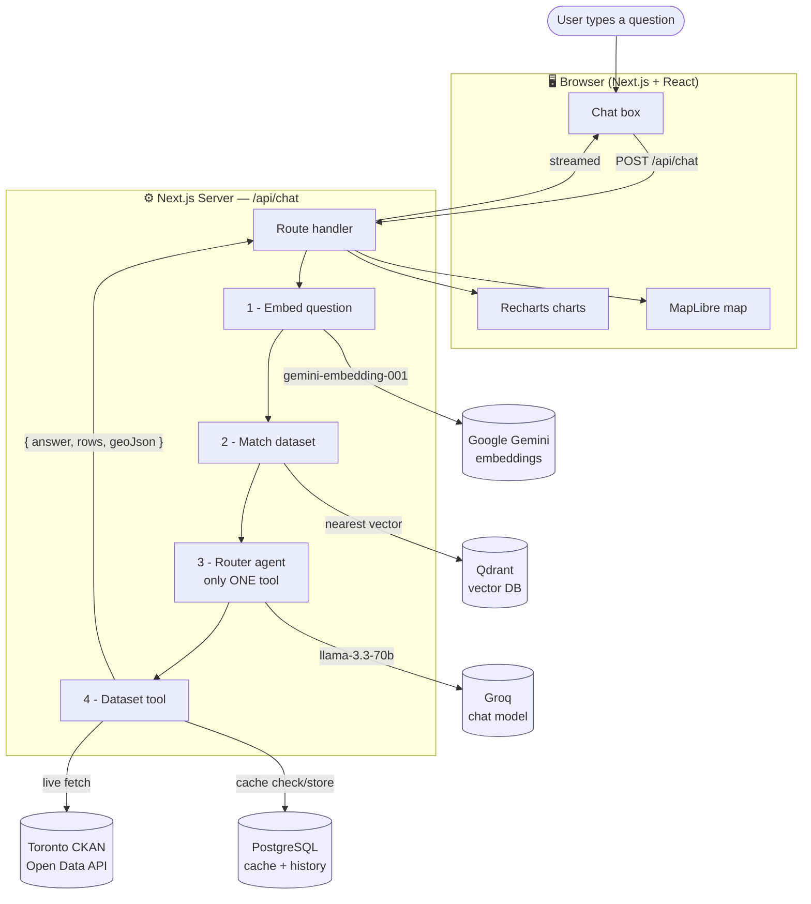
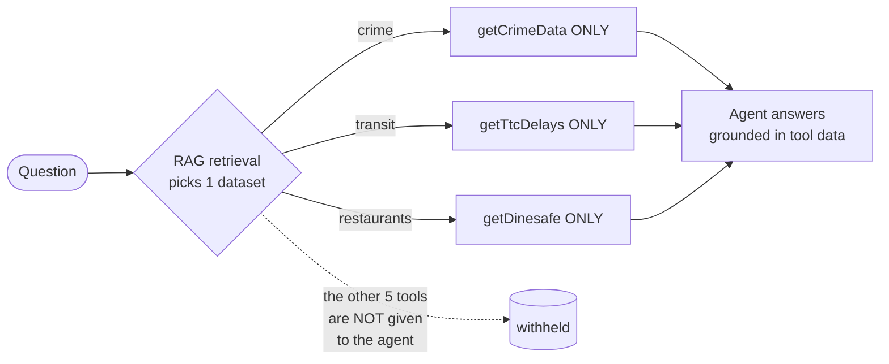
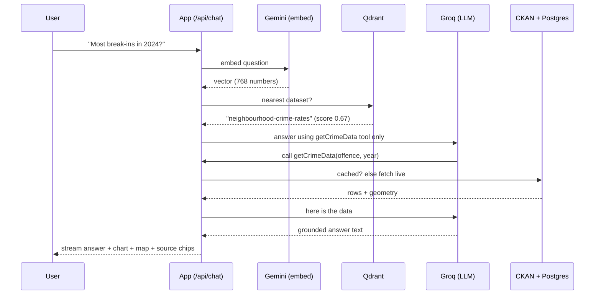
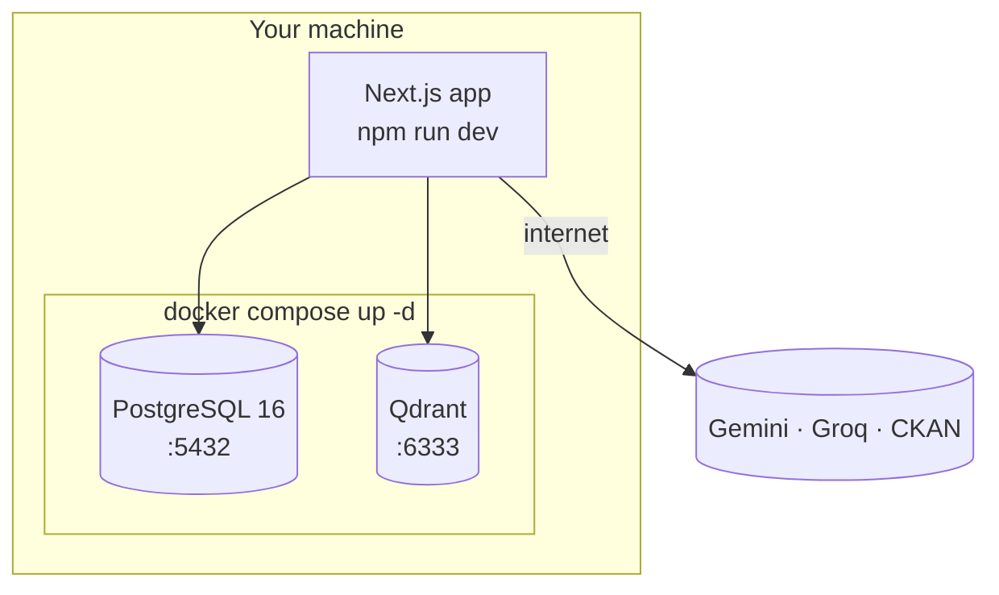

# Architecture

> These diagrams render automatically on GitHub (Mermaid). They describe how a
> question flows through Ask Toronto from the browser to real Toronto open data
> and back.

## System overview

## The router pattern (why answers stay accurate)

**Key idea:** retrieval selects the dataset *first*, then the agent is built with only
that dataset's tool — so it can't pick the wrong one. This is far more reliable than
handing the model all six tools at once.

## Request lifecycle (step by step)

## Infrastructure (what Docker runs)

